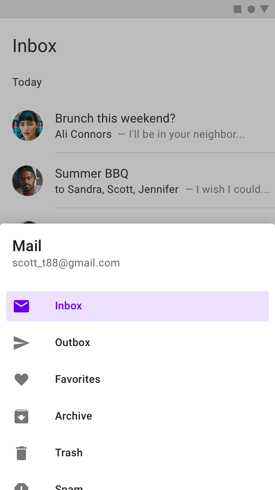

<!--docs:
title: "NavigationDrawer"
layout: detail
section: components
excerpt: "Navigation drawers provide access to destinations and app functionality, such as switching accounts."
path: /catalog/navigation-drawer/
api_doc_root: true
-->

# Navigation Drawer

[](https://github.com/material-components/material-components-ios/issues?q=is%3Aopen+is%3Aissue+label%3Atype%3ABug+label%3A%5BNavigationDrawer%5D)

[Navigation drawers](https://material.io/components/navigation-drawer) provide access to destinations and app functionality, such as switching accounts. They can either be permanently on-screen or controlled by a navigation menu icon.



Navigation drawers are recommended for:
  <li class="icon-list-item icon-list-item">Apps with five or more top-level destinations.</li>
  <li class="icon-list-item icon-list-item">Apps with two or more levels of navigation hierarchy.</li>
  <li class="icon-list-item icon-list-item">Quick navigation between unrelated destinations.</li>

## Contents

* [Using navigation drawers](#using-navigation-drawers)
* [Installing navigation drawers](#installing-navigation-drawers)
* [Making navigation drawers accessible](#making-navigation-drawers-accessible)
* [Theming navigation drawers](#theming-navigation-drawers)

## Using navigation drawers

While there is such a thing as a side navigation drawer, for example, we only provide bottom navigation drawers. Our bottom navigation drawer implementation is centered around `MDCBottomDrawerViewController`, a `UIViewController` subclass. `MDCBottomDrawerViewController` has a `contentViewController` property, whose view is displayed as the primary content of the drawer, as well as a `headerViewController` property, whose view is positioned above the content view controller and sticks to the top when the drawer is full-screen. For more information on implementing custom view controller classes see [Apple's View Controller Programming Guide](https://developer.apple.com/library/archive/featuredarticles/ViewControllerPGforiPhoneOS/DefiningYourSubclass.html#//apple_ref/doc/uid/TP40007457-CH7-SW1).

`MDCBottomDrawerViewController` presentation makes use of the `UIPresentationController` subclass `MDCBottomDrawerPresentationController`, as well as `MDCBottomDrawerTransitionController`, which conforms to `UIViewControllerTransitioningDelegate`.

If the primary content displayed in a bottom drawer is a [`UITableView`](https://developer.apple.com/library/archive/documentation/UserExperience/Conceptual/TableView_iPhone/CreateConfigureTableView/CreateConfigureTableView.html) or [`UICollectionView`](https://developer.apple.com/library/archive/documentation/WindowsViews/Conceptual/CollectionViewPGforIOS/Introduction/Introduction.html), specifically one that fills the content area, we recommend setting it as the `trackingScrollView` property for more performant scrolling.

It is important that the view controller used as the `headerViewController` conforms to the `MDCBottomDrawerHeader` protocol, which implements the method `-updateDrawerHeaderTransitionRatio:`. This method provides `transitionToTopRatio`, a `CGFloat` that moves between 0 to 1 as the header view transitions from being positioned above the content to being sticky at the top of the screen. The transition begins as the header view begins to cover the status bar and safe area and ends once the header has reached the top of the screen.

### Example using the `MDCBottomDrawerViewController` with/without a header

<!--<div class="material-code-render" markdown="1">-->
#### Swift

```swift
let bottomDrawerViewController = MDCBottomDrawerViewController()
bottomDrawerViewController.contentViewController = UIViewController()
bottomDrawerViewController.headerViewController = UIViewController() # this is optional
present(bottomDrawerViewController, animated: true, completion: nil)
```

#### Objective-C

```objc
MDCBottomDrawerViewController *bottomDrawerViewController = [[MDCBottomDrawerViewController alloc] init];
bottomDrawerViewController.contentViewController = [UIViewController new];
bottomDrawerViewController.headerViewController = [UIViewController new];
[self presentViewController:bottomDrawerViewController animated:YES completion:nil];
```
<!--</div>-->

### Example presenting a drawer without a header

<!--<div class="material-code-render" markdown="1">-->
#### Swift

```swift
let contentViewController = UIViewController()
contentViewController.transitioningDelegate = MDCBottomDrawerTransitionController()
contentViewController.modalPresentationStyle = .custom
present(contentViewController, animated: true, completion: nil)
```

#### Objective-C

```objc
UIViewController *contentViewController = [UIViewController new];
contentViewController.transitioningDelegate = [MDCBottomDrawerTransitionController new];
contentViewController.modalPresentationStyle = UIModalPresentationCustom;
[self presentViewController:contentViewController animated:YES completion:nil];
```
<!--</div>-->

### Example using `trackingScrollView`

<!--<div class="material-code-render" markdown="1">-->
#### Swift

```swift
let contentViewController = UITableViewController()
let bottomDrawerViewController = MDCBottomDrawerViewController()
bottomDrawerViewController.contentViewController = contentViewController
bottomDrawerViewController.headerViewController = UIViewController() # this is optional
bottomDrawerViewController.trackingScrollView = contentViewController.view
present(bottomDrawerViewController, animated: true, completion: nil)
```

#### Objective-C

```objc
UITableViewController *contentViewController = [UITableViewController new];
MDCBottomDrawerViewController *bottomDrawerViewController = [[MDCBottomDrawerViewController alloc] init];
bottomDrawerViewController.contentViewController = contentViewController;
bottomDrawerViewController.headerViewController = [UIViewController new];
bottomDrawerViewController.trackingScrollView = contentViewController.view;
[self presentViewController:bottomDrawerViewController animated:YES completion:nil];
```
<!--</div>-->

## Installing navigation drawers

Add the following to your `Podfile`:

```bash
pod 'MaterialComponents/NavigationDrawer'
```
<!--{: .code-renderer.code-renderer--install }-->

Then, run the following command:

```bash
pod install
```

### Importing

To import the component:

<!--<div class="material-code-render" markdown="1">-->
#### Swift
```swift
import MaterialComponents.MaterialNavigationDrawer
```

#### Objective-C

```objc
#import "MaterialNavigationDrawer.h"
```
<!--</div>-->

## Making navigation drawers accessible

While `MDCBottomDrawerViewController` supports the accessibility escape "Z" gesture, it is advisible that the content view controller provides its own dismiss action affordance. Note that it is the responsibility of the header and content view controllers to implement any custom accessibility behavior.

## Theming navigation drawers

While `MDCBottomDrawerViewController` does have a theming extension, it should not be relied on for ensuring the content and header are themed correctly. It only sets properties like corner radius, scrim color, and handle color. To display sufficiently themed content with `MDCBottomDrawerViewController` you must make sure the content and header view controllers are themed independently.

To make use of the bottom drawer theming extension you need to install it wth Cocoapods. First, add the following line to your `Podfile`.

```bash
pod MaterialComponents/NavigationDrawer+Theming
```

<!--{: .code-renderer.code-renderer--install }-->

Then Run the installer.

```bash
pod install
```

Next, import the NavigationDrawer theming target, and call the correct theming method.

<!--<div class="material-code-render" markdown="1">-->
#### Swift
```swift
import MaterialComponents.MaterialNavigationDrawer
import MaterialComponents.MaterialNavigationDrawer_Theming

...
 // Create a navigation drawer
let bottomDrawerViewController = MDCBottomDrawerViewController()
 // Create or use your app's Container Scheme
let containerScheme = MDCContainerScheme()
 // Theme the bottom drawer
bottomDrawerViewController.applyTheme(withScheme: containerScheme)
```

#### Objective-C
```objc
#import "MaterialNavigationDrawer.h"
#import "MaterialNavigationDrawer+Theming.h"

...
 // Create a navigation drawer
MDCBottomDrawerViewController *bottomDrawerViewController = [[MDCBottomDrawerViewController alloc] init];
 // Create or use your app's Container Scheme
MDCContainerScheme *containerScheme = [[MDCContainerScheme alloc] init];
 // Theme the bottom drawer
[bottomDrawerViewController applyThemeWithScheme:containerScheme];
```
<!--</div>-->
